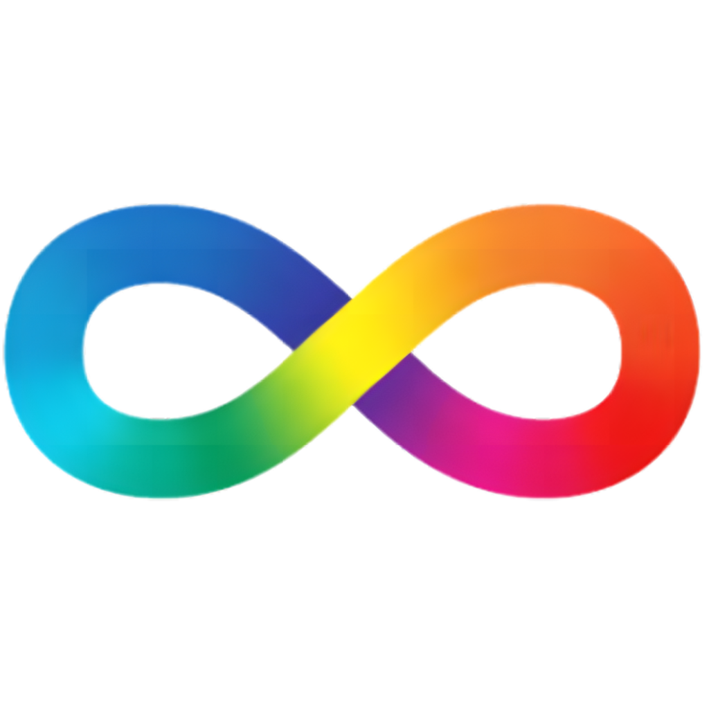

# DiverGente - Equilibre seus pensamentos

[](https://opensource.org/licenses/MIT)

## Sobre o Aplicativo

Equilibre seus pensamentos.

Com o **DiverGente**, você pode registrar suas emoções, tarefas a serem realizadas e também notas de áudio. Tenha um espaço pessoal para organizar seus pensamentos e acompanhar seu bem-estar.

## Privacidade

Sua privacidade é muito importante.

Por isso, todos os dados são salvos **apenas no seu aparelho**, garantindo que você tenha total controle sobre suas informações.

Caso queira, você tem a liberdade de **deletar todos os dados armazenados** no aplicativo a qualquer momento.

<p align="center">
  
</p>


## Download apk

https://github.com/phaleixo/DiverGente/releases/download/V1.0/DiverGente-V1_0.apk

## Download Code

1. Clone Repository

   ```
   git clone https://github.com/phaleixo/DiverGente.git
   ```
2. Acess folder

   ```bash
   cd DiverGente
   ```


3. Install dependencies

   ```bash
   npm install
   ```

4. Start the app

   ```bash
    npm start
   ```


## Contato

Desenvolvido por [phaleixo](https://github.com/phaleixo).

[](https://github.com/phaleixo)
[](mailto:phaleixo@outlook.com.br)

## Licença

DiverGente v1.0 licenciado sob a [MIT License](https://opensource.org/licenses/MIT).

---

